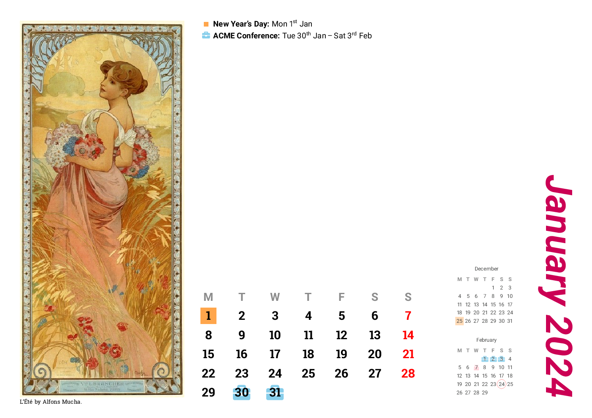
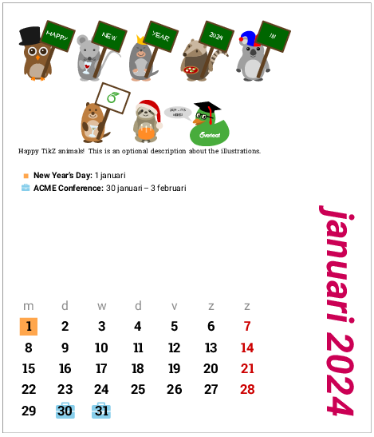
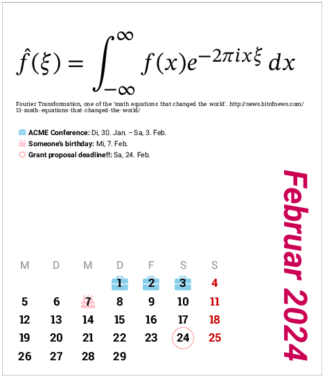

# Customisable multilingual calendars with LaTeX

The calendars are printed 4-up to fit 3.5" floppy disk jewel cases, or 2-up to fit CD jewel cases, or a fullsize A4 (portrait or landscape) version for wall calendars.

Colours, illustrations, fonts etc are customisable. The calendars can be marked with events with date ranges. See [this blog post](https://www.overleaf.com/blog/217-a-multilingual-customisable-cd-slash-floppy-disk-jewel-case-calendar-with-latex) for more information. [Templates are available on Overleaf.](https://www.overleaf.com/latex/templates/desktop-calendar-with-events/htkctjjgmxjx)

## Class options for size and layout
- (default, no class option): fits CD cases (11.7cm x 13.65cm)
- `small`: like a floppy disk, 9cm x 7.5cm

- `giant`: A4 paper, portrait

- `giant,landscape`: A4 paper, landscape

- `giantsolo` or `giantsolo,landscape`: like above, but without the mini calendars for previous/next months.
- `kuda`: this will fill the empty day boxes before the first and after the last days of the month with `\kudafiller` (default is an en-dash), like the "kuda" calendars popular in Malaysia and Singapore. 


## Language Localisation

Localisation possible with languages supported by `babel`/`translator`/`datetime2` by passing language names as class options. For example with `dutch` and `german`:





The Chinese example is best compiled with XeLaTeX. The Japanese example is best compiled with LuaLaTeX.

For (partially) unsupported languages or if you'd like to customise the localisations yourself, either because the language isn't supported by `babel` and `translator`, or because the language doesn't lend itself well to having the first letter extracted for the week day headings (e.g. Chinese), you can. In this case do your own modifications; see `ChineseCalendar.tex` and `zh-mod.sty` for an example. You'll most likely want to stop `cdcalendar` from loading babel in this case, so use the `nobabel` option:

```latex
\documentclass[sundayweek,nobabel]{cdcalendar}
\usepackage{zh-mod}
```

where `zh-mod.sty` contains:
```latex
\deftranslation{January}{一月}
\deftranslation{February}{二月}
...
\deftranslation{Jan}{一月}
\deftranslation{Feb}{二月}
...
\deftranslation{Sunday}{日}
\deftranslation{Monday}{一}
\deftranslation{Tuesday}{二}
...
```

You can still write `\usepackage[...]{babel}` yourself in the preamble (for hyphenations etc), but it won't have any effects on the month and week day names , nor the date localisations; you'll have to provide your own mods. Example for Bahasa Melayu:

```latex
\documentclass[nobabel]{cdcalendar}    % don't load babel yet!
\usepackage{ms-mod}   % our own Bahasa Melayu localisation
\usepackage[bahasam]{babel}  % if you need Bahasa Melayu hyphenation patterns for events and captions
```


## Marking Events on the Calendar

An example of a month calendar with events:

```latex
\begin{monthCalendar}{2015}{10}

%% This is a 1-day event
\event{2015-10-25}{}{Daylight saving time ends}

%% This is a 5-day event starting Oct 26th
\event{2015-10-26}{5}{Autumn half-term holiday}

%% You could also write
%\event{2015-10-26}{2015-10-30}{Autumn half-term holiday}
\end{monthCalendar}
\clearpage %% Do remember to insert a page break
```

The events mark and style can be customised: (All `\tikzset` styles for use with
`mark style` should be issued in the document preamble.)

```latex
% In the preamble
\tikzset{blue icon/.style={text=SkyBlue!60,font=\large}}
% In the monthCalendar
\event[mark style=blue icon, marker=\faCake]{2015-10-10}{Someone's birthday}
```

Currently the value for `mark style` must be a single style name.


## Cover and Calendar Illustrations

For the cover page:

```latex
\coverBgColor{black}
\coverImage[caption]{image-filename}
\coverTitle[tikz style]{Calendar Title}

\makeCover
```

You can add an illustration on each page (the length is the width of the image). Note that this needs to be issued _outside_ the `monthCalendar` environment.

```latex
\illustration[image caption]{8.5cm}{filename.png}
```

...or in fact you could insert anything that'll be typeset as a minipage: (new in v1.2)

```latex
\otherstuff[caption]{8.5cm}{\Huge Perhaps a Smart Quote Here?}
```

## Other settings

There are a few other settings you can set as well. These can be re-issued at any point in the document to change the styles.

```latex
\captionStyle{font=\sffamily\itshape\tiny}
\dayHeadingStyle{font=\sffamily,text=gray!90}
\sundayColor{red!70!black}
\monthTitleStyle{font={\Huge\sffamily},text=RoyalBlue}
\eventStyle{\scriptsize\sffamily}
\newcommand{\printeventname}[1]{\textbf{#1}}   % can be renewed
\newcommand{\eventSep}{: }  % can be renewed
```

## Multiple calendar systems

`zh-CDcase-nongli.tex` demonstrates how another calendar system, e.g. the Chinese nongli calendar, can be incorporated. The mapping between the Chinese nongli calendar and the Gregorian calendar was downloaded from [here](https://github.com/infinet/lunar-calendar/blob/master/chinese_lunar_prev_year_next_year.ics) and then converted to a `.csv` file with [this tool](https://www.indigoblue.eu/ics2csv/).
